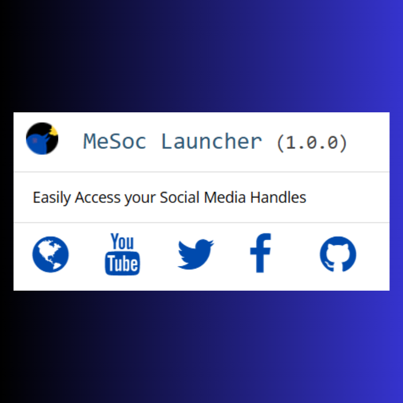

# MeSocLauncher

**Version:** 1.0.0

## Overview
**MeSocLauncher** is a social media launcher that allows users to quickly access their social media profiles LinkedIn, YouTube, Twitter, Instagram, and GitHub in one click, from a centralized, compact interface. Designed for simplicity and efficiency, MeSocLauncher opens links in a new tab and provides an intuitive, accessible user experience with a consistent design.

## Installation
1. **Clone or download** the repository to your local machine.
2. **Open** `index.html` in your favourite code editior like VS COde, Atom etc
3. **Customise** the links and names as per your preferences.

## Customization
- **Icons**: Change icon colors by modifying the `color` attribute in the `.fa` classes within `<style>`.
- **Links**: Update URLs directly in the HTML file under `<a href="">`.
- **Font**: The app uses Google Fonts (`Open Sans`), easily changeable if you wish to personalize further.

